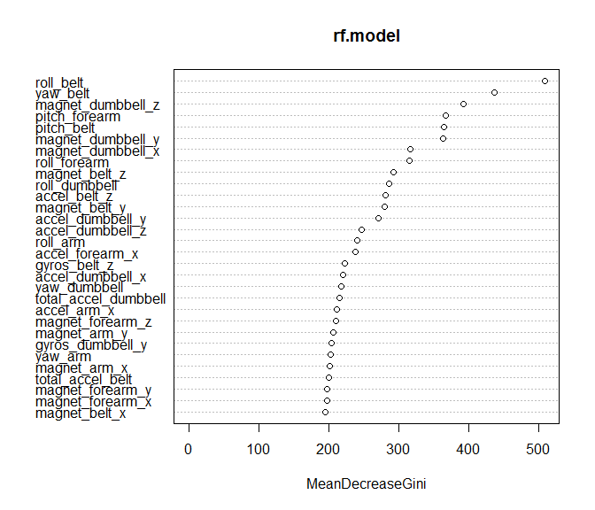

Executive Summary - Predicting Exercise Performance
---------------------------------------------------

The purpose of this study predict the manner in which an individual
exercise was performed.

A considerable amount of data is collected from wearable devices which
capture how much specific activities are performed. For example, an
individual may be interested in recording how many weight lifting
repetitions they accomplished. However, it should be possible to attest
to whether or not they did each repetition properly and record the
number of mistakes.

We shall model movemements collected from accelerometers during these
exercises located at 4 locations on the each participant:

1.  The belt
2.  The upper arm
3.  The forearm
4.  The weight itself.

Six participants performed 10 repetitions of unilateral dumbbell biceps
curls in 5 different manners:

1.  Exactly according to the specification (Class A),
2.  Throwing the elbows to the front (Class B),
3.  Lifting the dumbbell only halfway (Class C),
4.  Lowering the dumbbell only halfway (Class D)
5.  Throwing the hips to the front (Class E).

Class 'A' corresponds to the exercise being performed correctly. The
remaining activity classes correpond to common mistakes. Each method is
specified in the source data by the variable "classe".

*The data used was kindly made available from
<http://groupware.les.inf.puc-rio.br/har> . Thank you to the
collaborators involved during the study.*

### Building Our Model

We began our analysis by exploring the source data. The data contains a
mixture of both granular time series of movements as well as summary
statistics pertaining to the entire range of motion per repetition. We
begin my eliminating the sparse values from our data.

    # Load the source data.
    #options(stringsAsFactors = TRUE)
    pml_training <- read.csv("./pml-training.csv", header = TRUE)
    pml_testing  <- read.csv("./pml-testing.csv",  header = TRUE)

Since our test data only contains specific points and not the full range
of motion in a repetition, we shall exclude these rows from our training
data denoted by the "new window" value.

    pml_training <- subset(pml_training, new_window == "no")

Also, we shall exclude the sparsity of the data caused by empty columns.

    temp <- as.data.table(pml_training)
    temp <- temp[,which(unlist(lapply(temp, function(x)!all( is.na(x)) ))), with=F]

    # clean residual levels that are of 1 distinct value
    temp <- droplevels(temp)
    temp <- temp[, (names(temp)[which(sapply(temp, uniqueN) == 1)]) := NULL]

The test cases we will be classifying do not account for the full range
of motion and are granular points in time recorded within a repetition.
Our model will be compiled respective of the same level so we remove the
time related metrics. Also, since our model should be capable of
predicting what action was performed, "num\_window", should absolutely
be removed as it was left in the test data and has a direct correlation
to the classe in the data available for training.

    # remove the row ordinal value
    # remove the timeseries details
    temp <- temp[,-c('X', 'raw_timestamp_part_1', 'raw_timestamp_part_2', 'cvtd_timestamp', 'num_window')]
    sourcedata <- as.data.frame(temp)

### Training Data

We shall train our model using 75% of the observations in our source
data. Later, we will use the remaining observations to cross-validate
our predictive model.

    train_part <- createDataPartition(y=sourcedata$classe, p=3/4)[[1]]
    training <- sourcedata[train_part,]
    validation <- sourcedata[-train_part,]

### Model using Random Forest

The model is compiled using random forest. Random forest estimates a
test set error internally. Each decision tree is constructed using a
different bootstrap sample from the training data. Each tree leaves uses
approx 2/3 of the data in the bootstrap sample. The remaining 1/3 are
left out and may be used to calculate the expected out-of-sample error.
This is referred to as the "out-of-bag" (OOB) data.

    rf.model <- randomForest(classe ~ ., data=training, mtry=2, ntree=500)
    print(rf.model)

    ## 
    ## Call:
    ##  randomForest(formula = classe ~ ., data = training, mtry = 2,      ntree = 500) 
    ##                Type of random forest: classification
    ##                      Number of trees: 500
    ## No. of variables tried at each split: 2
    ## 
    ##         OOB estimate of  error rate: 0.74%
    ## Confusion matrix:
    ##      A    B    C    D    E  class.error
    ## A 4100    1    3    0    0 0.0009746589
    ## B   20 2765    4    0    0 0.0086052349
    ## C    0   17 2494    3    0 0.0079554495
    ## D    0    0   50 2308    3 0.0224481152
    ## E    0    0    2    4 2640 0.0022675737

### Cross Validation

Using the validation data prepared earlier, we will cross-validate our
model.

    predictions <- predict(rf.model, validation)
    confusionMatrix(predictions, validation[,c("classe")])

    ## Confusion Matrix and Statistics
    ## 
    ##           Reference
    ## Prediction    A    B    C    D    E
    ##          A 1367    8    0    0    0
    ##          B    0  919    5    0    0
    ##          C    0    2  833   11    0
    ##          D    0    0    0  775    1
    ##          E    0    0    0    0  881
    ## 
    ## Overall Statistics
    ##                                           
    ##                Accuracy : 0.9944          
    ##                  95% CI : (0.9918, 0.9963)
    ##     No Information Rate : 0.2847          
    ##     P-Value [Acc > NIR] : < 2.2e-16       
    ##                                           
    ##                   Kappa : 0.9929          
    ##  Mcnemar's Test P-Value : NA              
    ## 
    ## Statistics by Class:
    ## 
    ##                      Class: A Class: B Class: C Class: D Class: E
    ## Sensitivity            1.0000   0.9892   0.9940   0.9860   0.9989
    ## Specificity            0.9977   0.9987   0.9967   0.9998   1.0000
    ## Pos Pred Value         0.9942   0.9946   0.9846   0.9987   1.0000
    ## Neg Pred Value         1.0000   0.9974   0.9987   0.9973   0.9997
    ## Prevalence             0.2847   0.1935   0.1745   0.1637   0.1837
    ## Detection Rate         0.2847   0.1914   0.1735   0.1614   0.1835
    ## Detection Prevalence   0.2863   0.1924   0.1762   0.1616   0.1835
    ## Balanced Accuracy      0.9988   0.9940   0.9954   0.9929   0.9994

### Expected Out-of-Sample Error

We shall calculate our out-of-sample error by calculating the percentage
of misclassified results. This is equivalent to 1 - accuracy of the
validation predictions.

    count_of_incorrect_predictions <- sum(predictions != validation$classe)
    count_of_predictions <- length(predictions)
    OOSE <- count_of_incorrect_predictions/count_of_predictions
    paste("Expected Out-of-Sample Error: ", round(100 * OOSE, 2), "%", sep="")

    ## [1] "Expected Out-of-Sample Error: 0.56%"

### Variable Importance

Observing variable importance, we can see that "roll belt"" contributes
to the most variance in the outcome.

    varImpPlot(rf.model)

### Prediction Results

The test data, containing 20 test cases, provided is applied to the
predictive model.

    prediction_results <- predict(rf.model, pml_testing)
    prediction_results

    ##  1  2  3  4  5  6  7  8  9 10 11 12 13 14 15 16 17 18 19 20 
    ##  B  A  B  A  A  E  D  B  A  A  B  C  B  A  E  E  A  B  B  B 
    ## Levels: A B C D E
