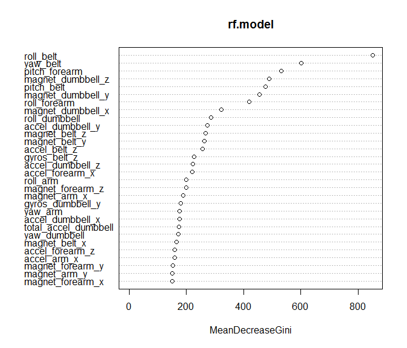
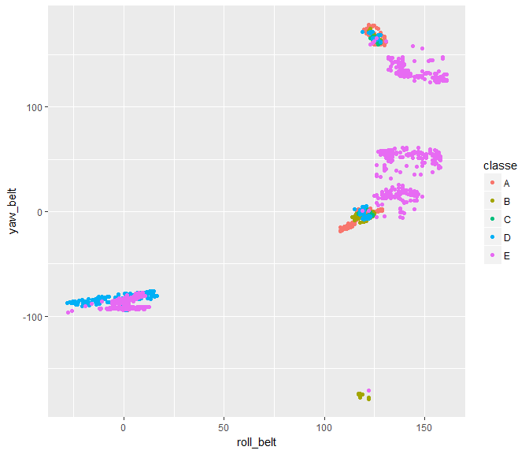

Executive Summary - Predicting Exercise Performance
---------------------------------------------------

The purpose of this study predict the manner in which an individual
exercise was performed.

A considerable amount of data is collected from wearable devices which
capture how much specific activities are performed. For example, an
individual may be interested in recording how many weight lifting
repetitions they accomplished. However, it should be possible to attest
to whether or not they did each repetition properly and record the
number of mistakes.

We shall model movemements collected from accelerometers during these
exercises located at 4 locations on the each participant: 1. The belt 2.
The upper arm 3. The forearm 4. The weight itself.

Six participants performed 10 repetitions of unilateral dumbbell biceps
curls in 5 different manners:

1.  Exactly according to the specification (Class A),
2.  Throwing the elbows to the front (Class B),
3.  Lifting the dumbbell only halfway (Class C),
4.  Lowering the dumbbell only halfway (Class D)
5.  Throwing the hips to the front (Class E).

Class 'A' corresponds to the exercise being performed correctly. The
remaining activity classes correpond to common mistakes. Each method is
specified in the source data by the variable "classe".

*The data used was kindly made available from
<http://groupware.les.inf.puc-rio.br/ha> Thank you to the collaborators
involved during the study.*

### Building Our Model

We began our analysis by exploring the source data. The data contains a
mixture of both granular time series of movements as well as summary
statistics pertaining to the entire range of motion per repetition. We
begin my eliminating the sparse values from our data.

Since our test data only contains specific points and not the full range
of motion in a repetition, we shall exclude these rows from our training
data denoted by the "new window" value.

    ## [1] 19216    54

### Training Data

We shall train our model using 70% of the observations in our source
data. Later, we will use the remaining 30% of observations to
cross-validate our predictive model.

    train_part <- createDataPartition(y=training$classe, p=0.70, list=FALSE)
    training <- training[train_part,]
    validation <- training[-train_part,]

### Model using Random Forest

    set.seed(57)
    rf.model <- randomForest(classe ~ ., data=training, method="class")
    print(rf.model)

    ## 
    ## Call:
    ##  randomForest(formula = classe ~ ., data = training, method = "class") 
    ##                Type of random forest: classification
    ##                      Number of trees: 500
    ## No. of variables tried at each split: 7
    ## 
    ##         OOB estimate of  error rate: 0.53%
    ## Confusion matrix:
    ##      A    B    C    D    E class.error
    ## A 3825    5    0    0    0 0.001305483
    ## B   13 2584    6    0    0 0.007299270
    ## C    0   11 2333    3    0 0.005965062
    ## D    0    0   24 2178    1 0.011348162
    ## E    0    0    2    6 2462 0.003238866

### Variable Importance

Observing variable importance, we can see that "roll belt"" contributes
to the most variance in the outcome. Here we plot the belt roll measure
with the 2nd principal component, belt yaw.

    varImpPlot(rf.model)

    qplot(roll_belt, yaw_belt, colour=classe, data=validation)

### Cross Validation

A validation dataset was created as an independent partition of the
source data. We shall use this to observe the out of sample error.

    predictions <- predict(rf.model, validation)
    confusionMatrix <- confusionMatrix(predictions, validation[,c("classe")])
    confusionMatrix

    ## Confusion Matrix and Statistics
    ## 
    ##           Reference
    ## Prediction    A    B    C    D    E
    ##          A 1164    0    0    0    0
    ##          B    0  758    0    0    0
    ##          C    0    0  716    0    0
    ##          D    0    0    0  678    0
    ##          E    0    0    0    0  735
    ## 
    ## Overall Statistics
    ##                                      
    ##                Accuracy : 1          
    ##                  95% CI : (0.9991, 1)
    ##     No Information Rate : 0.2873     
    ##     P-Value [Acc > NIR] : < 2.2e-16  
    ##                                      
    ##                   Kappa : 1          
    ##  Mcnemar's Test P-Value : NA         
    ## 
    ## Statistics by Class:
    ## 
    ##                      Class: A Class: B Class: C Class: D Class: E
    ## Sensitivity            1.0000   1.0000   1.0000   1.0000   1.0000
    ## Specificity            1.0000   1.0000   1.0000   1.0000   1.0000
    ## Pos Pred Value         1.0000   1.0000   1.0000   1.0000   1.0000
    ## Neg Pred Value         1.0000   1.0000   1.0000   1.0000   1.0000
    ## Prevalence             0.2873   0.1871   0.1767   0.1674   0.1814
    ## Detection Rate         0.2873   0.1871   0.1767   0.1674   0.1814
    ## Detection Prevalence   0.2873   0.1871   0.1767   0.1674   0.1814
    ## Balanced Accuracy      1.0000   1.0000   1.0000   1.0000   1.0000

### Expected out of sample error

Our out-of-sample error is estimated by substracting the total accuracy
from a potential 1 (100% accuracy).

    accuracy <- confusionMatrix$overall[1]
    outOfSampleError <- 1 - accuracy
    paste(round(100 * outOfSampleError, 4), "%")

    ## [1] "0 %"

### Predictions

The test data, containing 20 test cases, provided is applied to the
predictive model.

    prediction_results  <- predict(rf.model, pml_testing)
    prediction_results

    ##  1  2  3  4  5  6  7  8  9 10 11 12 13 14 15 16 17 18 19 20 
    ##  B  A  B  A  A  E  D  B  A  A  B  C  B  A  E  E  A  B  B  B 
    ## Levels: A B C D E
